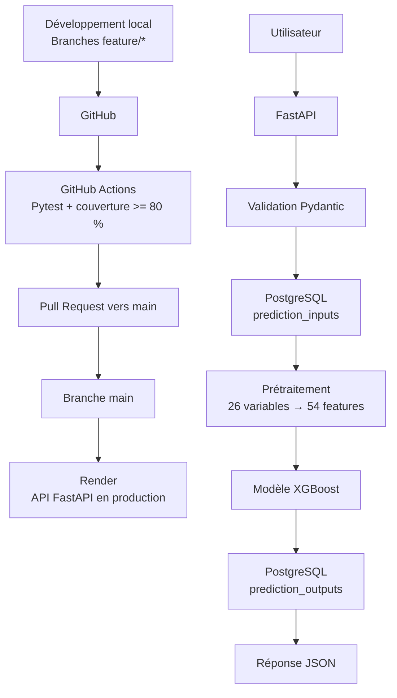

# Projet 5 - Déploiement d'un modèle de Machine Learning

Ce projet a pour objectif de rendre opérationnel un modèle de Machine Learning de prédiction du départ des employés.

Le modèle XGBoost entraîné lors d'un projet précédent est exposé à travers une API REST développée avec FastAPI.

Le projet intègre également :

- le prétraitement des données nécessaires au modèle ;
- la validation des données d'entrée avec Pydantic ;
- la persistance des prédictions dans une base PostgreSQL ;
- des tests unitaires, fonctionnels et d'intégration avec Pytest ;
- un contrôle de non-régression des performances du modèle ;
- une gestion reproductible des dépendances avec `uv`.

La mise en place d'un pipeline CI/CD avec GitHub Actions et d'un déploiement automatique sur Render complète l'architecture du projet.

## CI/CD

Le projet utilise GitHub Actions pour l'intégration continue et Render pour le déploiement en production.

### Environnements

- **Développement** : branches `feature/*` sur les postes de développement.
- **Test / intégration** : GitHub Actions exécute automatiquement la suite Pytest et vérifie la couverture du code.
- **Production** : branche `main`, automatiquement déployée sur Render après validation de la CI.

### Pipeline

```text
Branche feature/*
        |
        v
Push GitHub
        |
        v
GitHub Actions
        |
        +--> installation des dépendances avec uv
        +--> tests Pytest
        +--> contrôle de couverture >= 80 %
        |
        v
Pull Request vers main
        |
        v
Validation obligatoire des checks CI
        |
        v
Merge dans main
        |
        v
Déploiement automatique sur Render
        |
        v
API FastAPI en production
```

---

## Architecture générale

Le fonctionnement de l'application est le suivant :

```text
Utilisateur
    |
    v
API FastAPI
    |
    v
Validation Pydantic
    |
    v
PostgreSQL : prediction_inputs
    |
    v
Prétraitement des variables
    |
    v
Modèle XGBoost
    |
    v
PostgreSQL : prediction_outputs
    |
    v
Réponse JSON
```

## 🗄️ Base de données PostgreSQL

Le projet utilise PostgreSQL pour stocker le dataset RH et assurer la
traçabilité des prédictions réalisées par l'API.

La base utilisée en local est :

`projet5_ml`

L'accès à PostgreSQL depuis Python est réalisé avec **SQLAlchemy** et le
driver **psycopg**.

### Structure de la base

La base contient trois tables principales :

- `employees` : contient le dataset RH complet utilisé dans le projet
  (1 470 observations).
- `prediction_inputs` : enregistre les données envoyées à l'endpoint
  `/predict`.
- `prediction_outputs` : enregistre le résultat produit par le modèle,
  notamment la classe prédite et la probabilité d'attrition.

Les tables `prediction_inputs` et `prediction_outputs` sont reliées par
une clé étrangère :

`prediction_outputs.input_id -> prediction_inputs.id`

Cette relation permet de retrouver précisément les données ayant produit
chaque prédiction.

### Traçabilité d'une prédiction

Le fonctionnement est le suivant :

Utilisateur  
→ requête POST `/predict`  
→ validation des données avec Pydantic  
→ enregistrement dans `prediction_inputs`  
→ preprocessing des données  
→ prédiction XGBoost  
→ enregistrement dans `prediction_outputs`  
→ réponse JSON de l'API

Ainsi, chaque appel au modèle laisse une trace dans PostgreSQL.

### Création et alimentation de la base

Les scripts du dossier `app/` permettent de gérer la base :

- `create_db.py` : création des tables PostgreSQL ;
- `import_dataset.py` : import du dataset RH dans la table `employees` ;
- `database.py` : configuration de la connexion SQLAlchemy ;
- `database_models.py` : définition des modèles ORM représentant les tables.

La connexion peut être configurée avec la variable d'environnement
`DATABASE_URL`.

En environnement local, la base utilisée est PostgreSQL sur
`localhost`.

### Visualisation

La base peut être inspectée avec `psql` ou avec DBeaver.

DBeaver permet notamment de visualiser :

- les 1 470 observations de `employees` ;
- les entrées enregistrées dans `prediction_inputs` ;
- les résultats enregistrés dans `prediction_outputs` ;
- la relation entre les tables grâce au diagramme de clés étrangères.

### Exemple de résultat enregistré

Une prédiction réalisée via Swagger a produit :

- `prediction = 1`
- `probabilite_attrition = 0.13546`

L'entrée correspondante et son résultat ont été automatiquement
enregistrés dans PostgreSQL.

### Visualisation de la base PostgreSQL

Dataset chargé dans la table `employees` :


Résultats des prédictions enregistrées :


Relation entre les tables `prediction_inputs` et `prediction_outputs` :


### Gestion de la connexion à PostgreSQL

La connexion à PostgreSQL est configurée via la variable d'environnement
`DATABASE_URL`.

Si cette variable n'est pas définie, l'application utilise par défaut la
base locale :

`postgresql+psycopg://localhost/projet5_ml`

Cette configuration permet d'utiliser une base différente selon
l'environnement sans modifier le code source et sans stocker de secret
dans le dépôt Git.


## Architecture du projet


