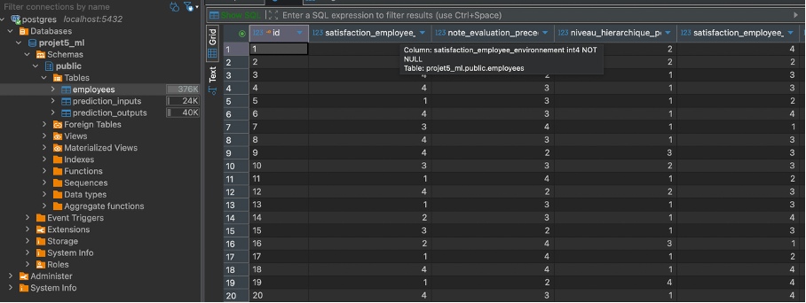
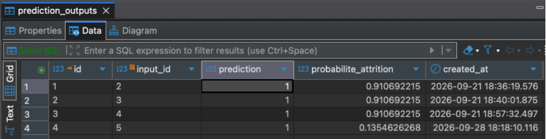
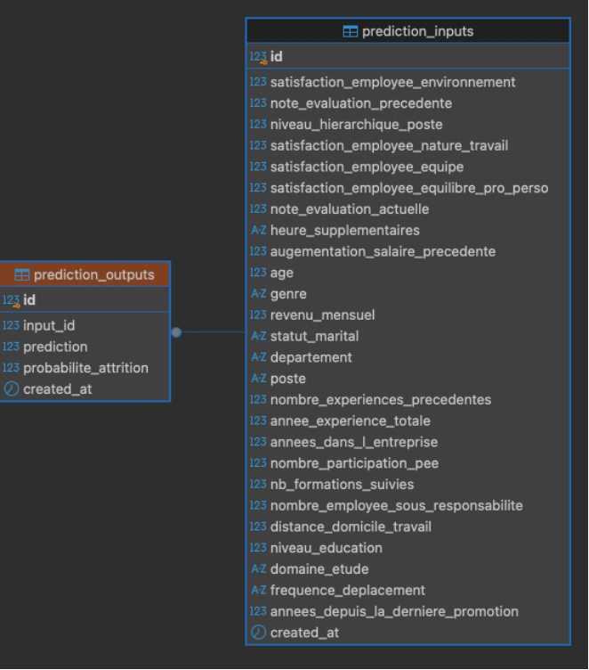
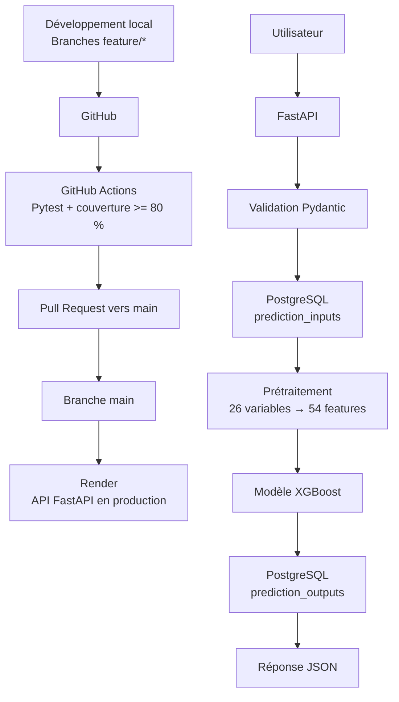

# Projet 5 - Déploiement d'un modèle de Machine Learning

Ce projet a pour objectif de rendre opérationnel un modèle de Machine Learning de prédiction du départ des employés.

Le modèle XGBoost entraîné lors d'un projet précédent est exposé à travers une API REST développée avec FastAPI.

Le projet intègre également :

- le prétraitement des données nécessaires au modèle ;
- la validation des données d'entrée avec Pydantic ;
- la persistance des prédictions dans une base PostgreSQL ;
- des tests unitaires, fonctionnels et d'intégration avec Pytest ;
- un contrôle de non-régression des performances du modèle ;
- une gestion reproductible des dépendances avec `uv`.

La mise en place d'un pipeline CI/CD avec GitHub Actions et d'un déploiement automatique sur Render complète l'architecture du projet.

---

## Installation et lancement

### Prérequis

Le projet nécessite principalement :

- Python 3.9 ;
- `uv` pour la gestion de l'environnement Python et des dépendances ;
- PostgreSQL pour la persistance des données et des prédictions ;
- Git pour récupérer et versionner le projet.

### 1. Cloner le dépôt

```bash
git clone https://github.com/thibaultdautheville/Projet-5-ML-Deploiement.git
cd Projet-5-ML-Deploiement
```

### 2. Installer les dépendances

Les dépendances du projet sont définies dans `pyproject.toml` et verrouillées dans `uv.lock`.

```bash
uv sync
```

`uv` crée ou met à jour l'environnement virtuel du projet avec les versions de dépendances attendues.

### 3. Préparer PostgreSQL

Une base PostgreSQL nommée :

```text
projet5_ml
```

est utilisée par défaut en environnement local.

La connexion locale par défaut est :

```text
postgresql+psycopg://localhost/projet5_ml
```

Elle peut être remplacée par la variable d'environnement :

```text
DATABASE_URL
```

### 4. Créer les tables

Le script `app/create_db.py` permet de créer les tables nécessaires au projet :

- `employees`
- `prediction_inputs`
- `prediction_outputs`

Exécution :

```bash
uv run python -m app.create_db
```

### 5. Importer le dataset RH

Le script `app/import_dataset.py` charge le dataset RH dans la table `employees`.

```bash
uv run python -m app.import_dataset
```

Le dataset utilisé contient :

- 1 470 observations ;
- 29 colonnes.

### 6. Lancer l'API

```bash
uv run uvicorn app.main:app --reload
```

L'API est alors disponible localement, par défaut à l'adresse :

```text
http://127.0.0.1:8000
```

La documentation Swagger peut être consultée à l'adresse :

```text
http://127.0.0.1:8000/docs
```

---

## Utilisation de l'API

L'API FastAPI expose plusieurs endpoints.

### `GET /`

Vérifie que l'API répond correctement.

### `GET /health`

Permet de contrôler l'état de l'application et le chargement du modèle.

### `POST /predict`

Effectue une prédiction d'attrition à partir des caractéristiques d'un employé.

Le schéma d'entrée est validé automatiquement avec Pydantic avant d'être transmis au modèle.

### `/docs`

FastAPI génère automatiquement une documentation Swagger/OpenAPI interactive.

Elle permet notamment :

- de consulter les endpoints disponibles ;
- de visualiser les schémas d'entrée et de sortie ;
- de tester directement l'endpoint `/predict`.

### Exemple de requête

Exemple de données envoyées à `POST /predict` :

```json
{
  "age": 34,
  "annee_experience_totale": 8,
  "annees_dans_l_entreprise": 5,
  "annees_depuis_la_derniere_promotion": 1,
  "augementation_salaire_precedente": 13,
  "departement": "Commercial",
  "distance_domicile_travail": 10,
  "domaine_etude": "Marketing",
  "frequence_deplacement": "Occasionnel",
  "genre": "M",
  "heure_supplementaires": "Non",
  "nb_formations_suivies": 3,
  "niveau_education": 3,
  "niveau_hierarchique_poste": 2,
  "nombre_employee_sous_responsabilite": 0,
  "nombre_experiences_precedentes": 2,
  "nombre_participation_pee": 1,
  "note_evaluation_actuelle": 3,
  "note_evaluation_precedente": 3,
  "poste": "Cadre Commercial",
  "revenu_mensuel": 4200,
  "satisfaction_employee_environnement": 3,
  "satisfaction_employee_equilibre_pro_perso": 2,
  "satisfaction_employee_equipe": 3,
  "satisfaction_employee_nature_travail": 4,
  "statut_marital": "Célibataire"
}
```

### Exemple de réponse

```json
{
  "prediction": 1,
  "probabilite_attrition": 0.13546262681484222
}
```

Dans cet exemple :

- `prediction = 1` correspond à une prédiction d'attrition ;
- `probabilite_attrition` correspond à la probabilité calculée par le modèle avant application du seuil de décision.

---

## Modèle de Machine Learning

Le modèle utilisé est un classifieur **XGBoost (`XGBClassifier`)** entraîné lors d'un projet précédent de classification RH.

### Données d'entrée

L'API reçoit **26 variables brutes** décrivant l'employé.

Ces variables sont ensuite transformées par le preprocessing afin de produire les variables réellement utilisées par le modèle.

### Prétraitement

Le preprocessing comprend notamment :

- la transformation des variables catégorielles ;
- la création de variables dérivées ;
- l'alignement des colonnes avec celles utilisées lors de l'entraînement.

À l'issue de cette étape :

```text
26 variables d'entrée
        ↓
prétraitement / feature engineering
        ↓
54 features
        ↓
XGBoost
```

Le modèle XGBoost attend exactement **54 features**.

### Artefacts du modèle

Plusieurs fichiers sont nécessaires au fonctionnement du modèle :

- le fichier du modèle XGBoost ;
- `feature_names.json` ;
- `threshold.json`.

#### `feature_names.json`

Ce fichier contient les noms des **54 features** dans l'ordre attendu par le modèle.

L'ordre est important : le modèle a été entraîné avec une structure précise des données.

Le preprocessing réindexe donc les données selon cette liste avant la prédiction.

Cette vérification évite notamment :

- une feature manquante ;
- une feature supplémentaire ;
- un changement accidentel de l'ordre des variables.

#### `threshold.json`

XGBoost produit initialement une probabilité d'attrition.

Le seuil contenu dans `threshold.json` permet ensuite de transformer cette probabilité en classe :

```text
probabilité
    ↓
comparaison au seuil
    ↓
classe 0 ou classe 1
```

Le seuil actuellement utilisé est associé à l'artefact de modèle déployé.

---

## Tests et performances

Le projet utilise **Pytest** pour automatiser les contrôles de qualité du code et du pipeline de prédiction.

Les tests peuvent être exécutés avec :

```bash
uv run python -m pytest
```

Pour exécuter les tests avec mesure de couverture :

```bash
uv run python -m pytest \
  --cov=app \
  --cov-report=term-missing \
  --cov-report=xml
```

### Couverture

La suite actuelle obtient environ :

```text
88 % de couverture du code applicatif
```

Le pipeline CI impose un seuil minimal de :

```text
80 %
```

Une couverture élevée signifie qu'une grande partie du code est exécutée pendant les tests.

Elle ne garantit cependant pas, à elle seule, la qualité du modèle ni la pertinence de toutes les assertions.

### Types de tests

Le projet distingue plusieurs niveaux de tests.

#### Tests API et validation

Ils vérifient notamment :

- le fonctionnement des endpoints ;
- les codes HTTP retournés ;
- les données invalides ;
- les champs obligatoires manquants ;
- les valeurs hors limites.

#### Tests du preprocessing et des features

Ils vérifient notamment :

- le nombre de features attendu ;
- les 54 features utilisées par le modèle ;
- leur ordre ;
- la reproductibilité du preprocessing ;
- plusieurs cas limites.

#### Tests fonctionnels

Ils vérifient le fonctionnement global du système à partir d'un individu représentatif du dataset.

Le principe testé est :

```text
données employé
    ↓
API
    ↓
préprocessing
    ↓
modèle
    ↓
prédiction
```

#### Tests d'intégration base de données

Les tests automatisés utilisent une base isolée afin de garantir leur reproductibilité.

Un test spécifique permet également de vérifier explicitement la connexion à PostgreSQL réel.

PostgreSQL reste la base de données utilisée par l'application pour la persistance réelle des prédictions.

#### Test de bout en bout API / base de données

Un test vérifie le chemin :

```text
requête API
    ↓
enregistrement input
    ↓
prédiction
    ↓
enregistrement output
```

#### Contrôle de non-régression du modèle

Un test spécifique contrôle également les performances de l'artefact ML.

Son objectif est surtout de détecter une régression accidentelle du modèle ou du preprocessing lors d'une modification du projet.

### Performances observées

Sur le jeu de test actuellement utilisé, avec le seuil de décision associé à l'artefact déployé, les métriques observées sont approximativement :

```text
Recall :     0.915
Precision :  0.194
F1-score :   0.320
```

Matrice de confusion correspondante :

```text
TN = 68
FP = 179
FN = 4
TP = 43
```

Le seuil actuellement utilisé privilégie donc fortement le **rappel** : il cherche à limiter les faux négatifs, au prix d'un nombre important de faux positifs.

Ces métriques servent principalement de **référence de non-régression pour l'artefact actuellement déployé**.

Elles ne signifient pas que le seuil ou le modèle constituent nécessairement l'optimum prédictif.

Une modification du modèle ou du seuil devrait donc être accompagnée :

- d'une nouvelle évaluation ;
- d'une justification métier ;
- d'une mise à jour des tests de non-régression.

---

## CI/CD

Le projet utilise GitHub Actions pour l'intégration continue et Render pour le déploiement en production.

### Environnements

- **Développement** : branches `feature/*` sur les postes de développement.
- **Test / intégration** : GitHub Actions exécute automatiquement la suite Pytest et vérifie la couverture du code.
- **Production** : branche `main`, automatiquement déployée sur Render après validation de la CI.

### Pipeline

```text
Branche feature/*
        |
        v
Push GitHub
        |
        v
GitHub Actions
        |
        +--> installation des dépendances avec uv
        +--> tests Pytest
        +--> contrôle de couverture >= 80 %
        |
        v
Pull Request vers main
        |
        v
Validation obligatoire des checks CI
        |
        v
Merge dans main
        |
        v
Déploiement automatique sur Render
        |
        v
API FastAPI en production
```

La branche `main` est protégée afin d'éviter une modification directe sans validation du pipeline.

---

## Architecture générale

Le fonctionnement de l'application est le suivant :

```text
Utilisateur
    |
    v
API FastAPI
    |
    v
Validation Pydantic
    |
    v
PostgreSQL : prediction_inputs
    |
    v
Prétraitement des variables
    |
    v
Modèle XGBoost
    |
    v
PostgreSQL : prediction_outputs
    |
    v
Réponse JSON
```

---

## 🗄️ Base de données PostgreSQL

Le projet utilise PostgreSQL pour stocker le dataset RH et assurer la
traçabilité des prédictions réalisées par l'API.

La base utilisée en local est :

`projet5_ml`

L'accès à PostgreSQL depuis Python est réalisé avec **SQLAlchemy** et le
driver **psycopg**.

### Structure de la base

La base contient trois tables principales :

- `employees` : contient le dataset RH complet utilisé dans le projet
  (1 470 observations).

- `prediction_inputs` : enregistre les données envoyées à l'endpoint
  `/predict`.

- `prediction_outputs` : enregistre le résultat produit par le modèle,
  notamment la classe prédite et la probabilité d'attrition.

Les tables `prediction_inputs` et `prediction_outputs` sont reliées par
une clé étrangère :

```text
prediction_outputs.input_id -> prediction_inputs.id
```

Cette relation permet de retrouver précisément les données ayant produit
chaque prédiction.

### Traçabilité d'une prédiction

Le fonctionnement est le suivant :

```text
Utilisateur
→ requête POST /predict
→ validation des données avec Pydantic
→ enregistrement dans prediction_inputs
→ preprocessing des données
→ prédiction XGBoost
→ enregistrement dans prediction_outputs
→ réponse JSON de l'API
```

Ainsi, les requêtes et résultats de prédiction peuvent être tracés dans PostgreSQL.

### Création et alimentation de la base

Les scripts du dossier `app/` permettent de gérer la base :

- `create_db.py` : création des tables PostgreSQL ;
- `import_dataset.py` : import du dataset RH dans la table `employees` ;
- `database.py` : configuration de la connexion SQLAlchemy ;
- `database_models.py` : définition des modèles ORM représentant les tables.

La connexion peut être configurée avec la variable d'environnement :

```text
DATABASE_URL
```

En environnement local, la base utilisée est PostgreSQL sur `localhost`.

### Visualisation

La base peut être inspectée avec `psql` ou avec DBeaver.

DBeaver permet notamment de visualiser :

- les 1 470 observations de `employees` ;
- les entrées enregistrées dans `prediction_inputs` ;
- les résultats enregistrés dans `prediction_outputs` ;
- la relation entre les tables grâce au diagramme de clés étrangères.

### Exemple de résultat enregistré

Une prédiction réalisée via Swagger a produit :

- `prediction = 1`
- `probabilite_attrition = 0.13546`

L'entrée correspondante et son résultat ont été automatiquement enregistrés dans PostgreSQL.

### Visualisation de la base PostgreSQL

Dataset chargé dans la table `employees` :



Résultats des prédictions enregistrées :



Relation entre les tables `prediction_inputs` et `prediction_outputs` :



### Gestion de la connexion à PostgreSQL

La connexion à PostgreSQL est configurée via la variable d'environnement
`DATABASE_URL`.

Si cette variable n'est pas définie, l'application utilise par défaut la
base locale :

```text
postgresql+psycopg://localhost/projet5_ml
```

Cette configuration permet d'utiliser une base différente selon
l'environnement sans modifier le code source et sans stocker de secret
dans le dépôt Git.

Dans l'état actuel du POC, PostgreSQL est démontré localement.

Le déploiement Render permet d'exposer l'API FastAPI. Une persistance PostgreSQL en environnement cloud nécessiterait de configurer `DATABASE_URL` avec l'adresse d'une base PostgreSQL accessible depuis Render.

---

## Architecture du projet



---

## Choix techniques

Les principaux choix technologiques du projet répondent aux besoins de déploiement, de reproductibilité et de traçabilité.

| Technologie | Rôle dans le projet | Justification |
|---|---|---|
| **FastAPI** | Exposition du modèle via une API REST | Framework Python léger, validation intégrée et génération automatique de Swagger/OpenAPI |
| **Pydantic** | Validation des données d'entrée | Garantit la conformité des données avant leur utilisation par le modèle |
| **XGBoost** | Modèle de classification | Modèle issu du projet ML précédent et déployé dans ce POC |
| **PostgreSQL** | Persistance des données et prédictions | Permet de conserver et tracer les entrées et sorties du modèle |
| **SQLAlchemy** | Accès à la base depuis Python | Fournit une couche ORM permettant de manipuler les données sous forme d'objets Python |
| **psycopg** | Driver PostgreSQL | Assure la communication entre SQLAlchemy et PostgreSQL |
| **Pytest** | Tests automatisés | Permet de couvrir les composants, l'API et les scénarios fonctionnels |
| **pytest-cov** | Mesure de couverture | Fournit un indicateur quantitatif de l'exécution du code pendant les tests |
| **uv** | Gestion des dépendances | Permet de reproduire rapidement et de manière déterministe l'environnement Python |
| **Git / GitHub** | Gestion de versions | Historique du projet, branches, Pull Requests et collaboration |
| **GitHub Actions** | Intégration continue | Exécute automatiquement les tests et contrôles de couverture |
| **Render** | Déploiement | Permet de déployer automatiquement l'API à partir de la branche `main` |
| **DBeaver** | Inspection de PostgreSQL | Permet de visualiser les données, tables et relations de la base |

---

## Sécurité et configuration

Aucun identifiant de base de données distante ne doit être stocké directement dans le code source.

Les informations dépendantes de l'environnement peuvent être transmises via des variables d'environnement.

Exemple :

```text
DATABASE_URL
```

Le fichier `database.py` utilise cette variable si elle existe.

À défaut, l'application utilise la configuration PostgreSQL locale prévue pour le développement et la démonstration du projet.

Les secrets destinés à un environnement de production doivent être configurés directement dans l'environnement d'exécution et ne pas être versionnés dans Git.

---

## Maintenance et mise à jour du modèle

Le déploiement d'un modèle de Machine Learning ne se limite pas à sa première mise en production.

Une procédure de mise à jour permet de limiter les risques de régression lorsqu'un nouvel artefact est produit.

### Mise à jour du modèle

Le processus recommandé est :

```text
Nouveau modèle
        |
        v
Vérification du preprocessing
        |
        v
Mise à jour de l'artefact du modèle
        |
        v
Vérification / mise à jour de feature_names.json
        |
        v
Vérification / mise à jour de threshold.json
        |
        v
Exécution de Pytest
        |
        v
Contrôle de non-régression des performances
        |
        v
Développement sur une branche feature/*
        |
        v
Push GitHub
        |
        v
GitHub Actions
        |
        v
Pull Request
        |
        v
Validation des checks CI
        |
        v
Merge dans main
        |
        v
Déploiement automatique sur Render
```

### Points à contrôler lors d'une mise à jour

Avant de remplacer le modèle existant, il faut notamment vérifier :

1. que le nouveau modèle attend le même nombre de features ou mettre à jour le preprocessing ;
2. que `feature_names.json` correspond exactement aux features du nouveau modèle ;
3. que l'ordre des features est correct ;
4. que le seuil de classification reste pertinent ;
5. que les schémas Pydantic correspondent toujours aux données d'entrée ;
6. que tous les tests Pytest passent ;
7. que le contrôle de performance ne détecte pas de régression inattendue ;
8. que la base de données reste compatible avec les données enregistrées ;
9. que la documentation est mise à jour si le comportement de l'API change.

### Évolution des performances

En cas de réentraînement du modèle, les performances du nouvel artefact doivent être comparées à celles de la version précédente.

Une modification du seuil ne doit pas être considérée comme une simple modification technique : elle change le compromis entre faux positifs et faux négatifs.

Elle doit donc être :

- mesurée ;
- documentée ;
- justifiée par le besoin métier ;
- accompagnée d'une mise à jour des tests concernés.

---

## Reproductibilité

La reproductibilité du projet repose sur plusieurs mécanismes :

```text
Code source
    +
pyproject.toml
    +
uv.lock
    +
artefacts du modèle
    +
feature_names.json
    +
threshold.json
    +
tests automatisés
```

Cette organisation permet à un nouvel environnement de reconstruire les dépendances nécessaires au fonctionnement du projet et de contrôler automatiquement que le comportement attendu est conservé.

---

## Résumé du fonctionnement

Le fonctionnement complet du POC peut être résumé ainsi :

```text
1. L'utilisateur envoie 26 variables à POST /predict
                          |
                          v
2. Pydantic valide les données
                          |
                          v
3. Les données sont enregistrées dans prediction_inputs
                          |
                          v
4. Le preprocessing construit les 54 features
                          |
                          v
5. Les features sont remises dans l'ordre attendu
                          |
                          v
6. XGBoost calcule une probabilité d'attrition
                          |
                          v
7. Le seuil transforme cette probabilité en classe
                          |
                          v
8. Le résultat est enregistré dans prediction_outputs
                          |
                          v
9. L'API renvoie la classe et la probabilité au client
```

Le code est versionné avec Git et GitHub.

Chaque modification importante passe par une branche dédiée, puis par GitHub Actions et une Pull Request avant d'être intégrée à `main`.

Le merge dans `main` déclenche ensuite le déploiement automatique de l'API sur Render.
